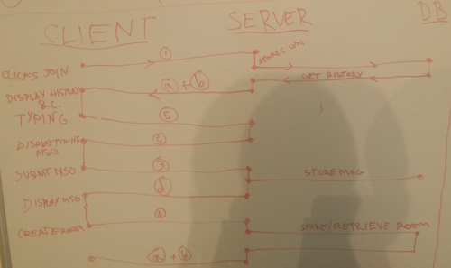
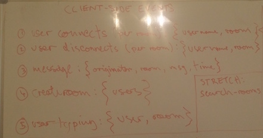
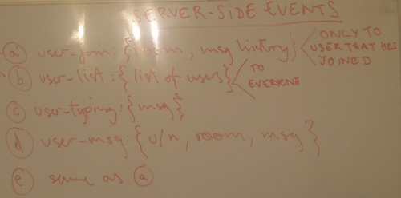
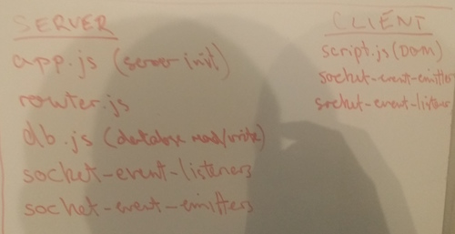

[](https://travis-ci.org/tasminions/minionchat)
[](https://codeclimate.com/github/tasminions/minionchat)
[](https://codeclimate.com/github/tasminions/minionchat)
[](http://codecrystal.herokuapp.com/crystalise/tasminions/minionchat/master)

# minionchat
Real time web chat

## WIREFRAMES


## EVENTS
### EVENT FLOW

* **userJoin** - upon fEnd connection ('connect'):
    * fEnd socket emits 'userJoin' with **connectionInfo** as an **object**: {username:"nameEntered",room:"main"}.
    * bEnd socket listens, takes the data. and:
        * **emits 'activeUsers'** event *to all users*, sending back activeusers list in **array** format.
            * fEnd listener to 'activeUsers' will *refresh list of active users* in the chat.
        * **emits 'msgHistory'** event to the *joining user only*, to provide the message history in **array of objects** format.
            * fEnd listener to 'msgHistory' will *append message history* as children to the messages ```<ul></ul>``` list.
        * **broadcast 'userJoin'** to rest of the users in the chat
* **userTyping** - upon 'input' in the textarea:
    * fEnd socket emits 'userTyping' event with usual connectionInfo *object*.
    * bEnd socket listens, takes the data, and:
        * **broadcasts 'userTyping'** event to all other users.
* **updateChat** - upon form 'submit':
    * fEnd socket emits 'updateChat' event, passing an object with the below format. fEnd also updates the messageHistory list for the user who submitted the chat.
    * bEnd sockets broascasts 'updateChat' event, passing the same object.
        * fEnd appends message to messageHistory list

**Message object format**:
```javascript
{
    "originator":"username",
    "body":"what the user wrote",
    "time": 1456391092857,
    "room": "roomName"
}
```

* **'newRoom'** - upon user clicking on one of the activeUsers in the main chat room:
    * fEnd emits:
      * **'userJoin'** event with **connectionInfo** object.
      * **'newRoom'** event with the following object {username2:"OtherUserName",room:"roomname"}
    * bEnd **emits 'newRoom'** event to the user who hasn't joined yet. **Note**: *server should check if the room is already created or not*, or if two users area already in the chat.
      * fEnd receives the 'newRoom' event and appends a message to the message history, containing an **invitation url** to join the chat.
         * Upon the **user clicking the url**, a new **'userJoin'** event will be emitted by the fEnd.

### CLIENT SIDE


### SERVER SIDE


## SAMPLE DATA STRUCTURE (within database)
```JSON
{
    "users":{
        "bugs-bunny":{
            "rooms":["room1","room2"]
        }
    },
    "messages": {
        "room1": [
            {
                "originator":"bugs",
                "body":"here is a message",
                "time":"24-01-2016:12.123321321312"
            }
        ],
        "room2":[],
        "room3":[]
    }
}
```

## JS FILE STRUCTURE

